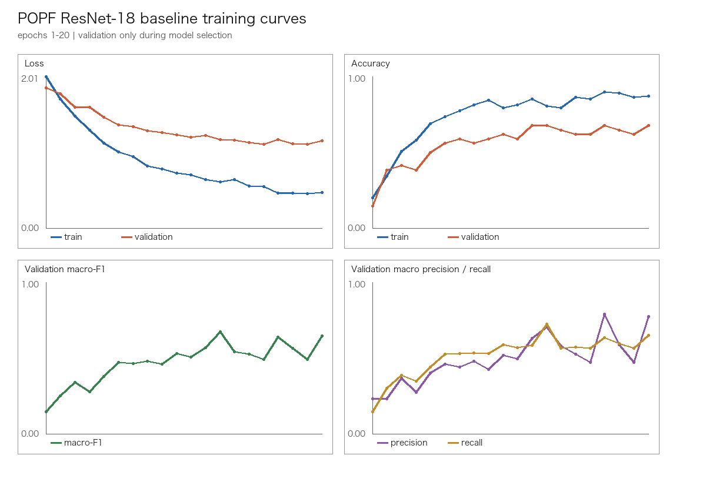
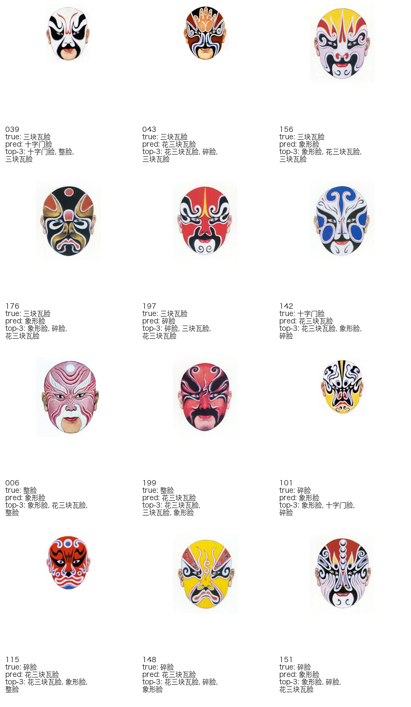

# POPF ResNet-18 Baseline Report

Status: `2026 Reconstruction` experiment. This is not a 2019 Original result.

Run timestamp (UTC): `2026-09-20T17:50:20.884707+00:00`

## 1. Data

- Dataset: `POPF modern_v1`
- Images: `222` (`train=154`, `validation=34`, `test=34`)
- Classes: `7`
- Split files were kept unchanged during this experiment.
- Test data was not used during training or model selection; it was evaluated once after selecting the best validation macro-F1 checkpoint.

| Label | Total | Train | Weight |
|---|---:|---:|---:|
| 三块瓦脸 | 73 | 51 | 0.431373 |
| 碎脸 | 45 | 31 | 0.709677 |
| 象形脸 | 35 | 25 | 0.880000 |
| 花三块瓦脸 | 27 | 19 | 1.157895 |
| 整脸 | 17 | 11 | 2.000000 |
| 十字门脸 | 15 | 11 | 2.000000 |
| 六分脸 | 10 | 6 | 3.666667 |

## 2. Model and training configuration

- Model: `resnet18`
- ImageNet pretrained weights: `True`
- Frozen backbone: `True`
- Input: `224x224` RGB, ImageNet normalization, no augmentation
- Loss: weighted Cross Entropy (`use_class_weight=True`)
- Optimizer: `AdamW`, learning rate `0.001`, weight decay `0.0001`
- Epochs: `20`; batch size: `16`; seed: `42`
- Device: `cpu`
- Parameters: `3591` trainable / `11180103` total

## 3. Training curves



The curves are generated from the recorded epoch history. Validation metrics were used for checkpoint selection.

## 4. Validation model selection

- Selected checkpoint: `artifacts/models/resnet18_baseline/best_val_macro_f1.pt`
- Selection criterion: best validation macro-F1
- Best validation macro-F1: `0.6715`
- Best validation accuracy: `0.6765`

## 5. Final test evaluation

The selected validation checkpoint was evaluated on the test split once.

- Accuracy: `0.441176`
- Macro precision: `0.578571`
- Macro recall: `0.466357`
- Macro F1: `0.481793`
- Top-3 accuracy: `0.852941`

### Confusion matrix

Rows are true labels and columns are predicted labels, in label-mapping order.

```text
[[6, 1, 2, 1, 0, 1, 0], [0, 2, 3, 2, 0, 0, 0], [0, 2, 3, 0, 0, 0, 0], [0, 3, 1, 0, 0, 0, 0], [0, 0, 1, 1, 1, 0, 0], [0, 0, 0, 1, 0, 1, 0], [0, 0, 0, 0, 0, 0, 2]]
```

### Per-class metrics

| Label | Support | Precision | Recall | F1 |
|---|---:|---:|---:|---:|
| 三块瓦脸 | 11 | 1.000000 | 0.545455 | 0.705882 |
| 碎脸 | 7 | 0.250000 | 0.285714 | 0.266667 |
| 象形脸 | 5 | 0.300000 | 0.600000 | 0.400000 |
| 花三块瓦脸 | 4 | 0.000000 | 0.000000 | 0.000000 |
| 整脸 | 3 | 1.000000 | 0.333333 | 0.500000 |
| 十字门脸 | 2 | 0.500000 | 0.500000 | 0.500000 |
| 六分脸 | 2 | 1.000000 | 1.000000 | 1.000000 |

## 6. Test Bad Cases

- Top-1 errors rendered for inspection (capped at 12): `12`; the prediction CSV contains all test samples.
- Full top-k output: `../artifacts/experiments/resnet18_baseline/test_predictions_top3.csv`



The saved prediction scores are model softmax outputs used as ranking scores; they are not calibrated probabilities.

## 7. Observations and next experiment

- The test confusion matrix shows prediction bias: the model predicts fewer `三块瓦脸` samples than their true support and more `碎脸`/`象形脸` alternatives.
- The most visible confusions are `碎脸` with `象形脸` and `花三块瓦脸`, plus several `三块瓦脸` samples assigned to neighboring visual categories.
- The small-support classes have unstable estimates: `花三块瓦脸` has test F1 `0.000000`, `十字门脸` has support `2`, and `六分脸` has support `2`; the perfect F1 for `六分脸` is not strong evidence because its support is only two images.
- Top-3 accuracy exceeds Top-1 accuracy by `0.411765` on this test split, so ranked alternatives are materially more useful than a single label for this baseline.
- The result is sufficient to validate the end-to-end training and evaluation pipeline, but not sufficient to claim production readiness or generalization beyond this small split.

**One next experiment:** after a focused manual audit of the `花三块瓦脸`/`碎脸`/`象形脸` examples and their labels, run a controlled fine-tuning comparison that unfreezes only ResNet-18 `layer4` plus the classification head. Keep the same split, seed, preprocessing, and test holdout, and select only on validation macro-F1.

The approximately 70% accuracy reported by the 2019 paper is historical `2019 Original` context and is not compared to this `2026 Reconstruction` result.

## 8. Reproducibility record

- Python: `3.14.7`
- PyTorch: `2.14.0`
- torchvision: `0.29.0`
- Label mapping: `{"三块瓦脸": 0, "碎脸": 1, "象形脸": 2, "花三块瓦脸": 3, "整脸": 4, "十字门脸": 5, "六分脸": 6}`
- Class weights were calculated from training rows only: `train.csv only`

No raw file was modified by the training script.
