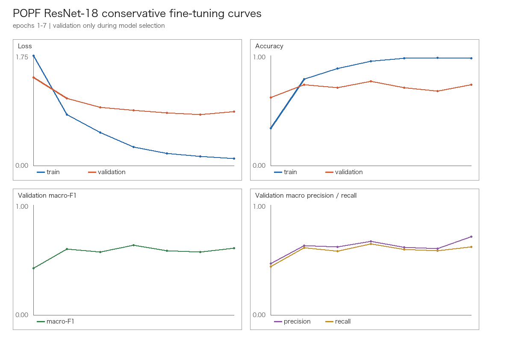

# POPF ResNet-18 Conservative Fine-tuning Report

Status: `2026 Reconstruction` experiment. This is not a 2019 Original result.

Run timestamp (UTC): `2026-09-21T20:56:34.182236+00:00`

## 1. Experiment purpose

This experiment tests whether lower learning rates and validation-macro-F1 early stopping reduce the overfitting observed in the previous `layer4 + fc` fine-tuning run.
The model structure remains unchanged: `conv1`, `bn1`, `layer1`, `layer2`, and `layer3` are frozen; `layer4` and `fc` are trainable.

## 2. Controlled conditions

- Dataset: `POPF modern_v1` with `train=154`, `validation=34`, `test=34`
- Existing modern_v1 split files and label mapping were reused without regeneration.
- Cross-split SHA-256 leakage was checked and remained zero.
- Test images were not iterated during training or validation model selection; the selected checkpoint was evaluated on test once.
- Layer4 learning rate: `5e-05`
- FC learning rate: `0.0005`
- Batch size: `16`, weight decay: `0.0001`, optimizer: `AdamW`
- Maximum epochs: `12`, patience: `3`, min_delta: `0.0`
- Actual epochs trained: `7`; early stopped: `True`

## 3. Trainability audit

- Frozen: `conv1`, `bn1`, `layer1`, `layer2`, `layer3`
- Trainable: `layer4`, `fc`
- Parameters: `8397319` trainable / `2782784` frozen / `11180103` total

| Module | Trainable | Parameters | Trainable parameters |
|---|---:|---:|---:|
| conv1 | False | 9408 | 0 |
| bn1 | False | 128 | 0 |
| layer1 | False | 147968 | 0 |
| layer2 | False | 525568 | 0 |
| layer3 | False | 2099712 | 0 |
| layer4 | True | 8393728 | 8393728 |
| fc | True | 3591 | 3591 |

## 4. Training history



| Epoch | Train loss | Train accuracy | Validation loss | Validation accuracy | Validation macro-F1 | Accuracy gap |
|---:|---:|---:|---:|---:|---:|---:|
| 1 | 1.753671 | 0.337662 | 1.404255 | 0.617647 | 0.426321 | -0.279985 |
| 2 | 0.812443 | 0.785714 | 1.073296 | 0.735294 | 0.598073 | +0.050420 |
| 3 | 0.524673 | 0.883117 | 0.925453 | 0.705882 | 0.571429 | +0.177235 |
| 4 | 0.294481 | 0.948052 | 0.880733 | 0.764706 | 0.633700 | +0.183346 |
| 5 | 0.194442 | 0.974026 | 0.838402 | 0.705882 | 0.584541 | +0.268144 |
| 6 | 0.143672 | 0.980519 | 0.813368 | 0.676471 | 0.571248 | +0.304049 |
| 7 | 0.109598 | 0.974026 | 0.858251 | 0.735294 | 0.605970 | +0.238732 |

## 5. Validation model selection

- Best epoch by validation macro-F1: `4`
- Validation accuracy: `0.764706`
- Validation macro-F1: `0.633700`
- Train accuracy at selected epoch: `0.948052`
- Train-minus-validation accuracy gap at selected epoch: `+0.183346`

| Label | Validation F1 at selected epoch |
|---|---:|
| 三块瓦脸 | 0.916667 |
| 碎脸 | 0.769231 |
| 象形脸 | 0.888889 |
| 花三块瓦脸 | 0.444444 |
| 整脸 | 0.750000 |
| 十字门脸 | 0.000000 |
| 六分脸 | 0.666667 |

## 6. Final test evaluation

The selected validation checkpoint was evaluated on the test split once.

- Accuracy: `0.617647`
- Macro precision: `0.701299`
- Macro recall: `0.543476`
- Macro F1: `0.591095`
- Top-3 accuracy: `0.882353`

### Confusion matrix

Rows are true labels and columns are predicted labels, in label-mapping order.

```text
[[10, 1, 0, 0, 0, 0, 0], [0, 3, 0, 4, 0, 0, 0], [0, 1, 4, 0, 0, 0, 0], [1, 2, 1, 0, 0, 0, 0], [0, 0, 0, 1, 2, 0, 0], [0, 0, 1, 0, 0, 1, 0], [0, 0, 1, 0, 0, 0, 1]]
```

### Per-class metrics

| Label | Support | Precision | Recall | F1 |
|---|---:|---:|---:|---:|
| 三块瓦脸 | 11 | 0.909091 | 0.909091 | 0.909091 |
| 碎脸 | 7 | 0.428571 | 0.428571 | 0.428571 |
| 象形脸 | 5 | 0.571429 | 0.800000 | 0.666667 |
| 花三块瓦脸 | 4 | 0.000000 | 0.000000 | 0.000000 |
| 整脸 | 3 | 1.000000 | 0.666667 | 0.800000 |
| 十字门脸 | 2 | 1.000000 | 0.500000 | 0.666667 |
| 六分脸 | 2 | 1.000000 | 0.500000 | 0.666667 |

## 7. Overfitting and stability analysis

- Train accuracy range during this run: `0.337662` to `0.980519`.
- At the selected epoch, the accuracy gap was `+0.183346`; at the final trained epoch it was `+0.238732`.
- Validation macro-F1 range during this run: `0.426321` to `0.633700`; population standard deviation: `0.062103`.
- For the first `7` epochs, conservative validation macro-F1 standard deviation was `0.062103` versus `0.081937` for the previous layer4 run.
- The previous layer4 run selected epoch `4`; this run selected epoch `4`.
- A smaller train/validation gap is treated as evidence of reduced fitting pressure, not proof of generalization by itself.

## 8. Bad Case analysis

- Top-1 error tiles rendered for inspection (capped at 12): `12`; the prediction CSV contains all test samples.
- Top-3 predictions: `../artifacts/experiments/resnet18_conservative_finetune/test_predictions_top3.csv`
- Three-way prediction comparison: `../artifacts/experiments/resnet18_conservative_finetune/three_way_test_predictions.csv`


The comparison file is used to inspect `碎脸`/`象形脸`/`花三块瓦脸` and `三块瓦脸` transitions across all three runs.

## 9. Answer to the experiment question

- Versus frozen baseline, validation macro-F1 changed by `-0.037758` and test macro-F1 changed by `+0.109302`.
- Versus the previous layer4 run, test macro-F1 changed by `+0.036782`, test accuracy changed by `+0.000000`, and test Top-3 changed by `+0.000000`.
- `花三块瓦脸` test F1 in this run: `0.000000`.

## 10. Next step

优先做数据质量 / 标签边界分析：当前实验仍未解决花三块瓦脸，且在 222 张小数据上继续改变 fine-tuning schedule 的证据不足。
No next experiment was executed automatically.

The approximately 70% accuracy reported by the 2019 paper is historical `2019 Original` context and is not compared to these `2026 Reconstruction` results.

## 11. Reproducibility

- Python: `3.14.7`
- PyTorch: `2.14.0`
- torchvision: `0.29.0`
- Device: `cpu`
- Raw input SHA-256 before and after: `{"data/raw/脸谱/整理工作/爬虫脸谱图集.zip": "171006b1eaae62b095b54b8472ded55ac2ac8b6803750c1c232e47a617a96b5a", "data/raw/脸谱新一步/272数据张丹阳.xls": "fa37243d2665a613bd52cf617f11d35db7f1a24c10c72bac89926c457ce109cc"}`
- Dataset split SHA-256: `{"train": "124779d85ee5c160264832e480dbd35c2a5541bc5cf42e50362c5bcd82656253", "validation": "1341665096ceb34056053a50750872472dee872cc39344e023324276441897c3", "test": "1dab96bb90c848871a0cb93f1559c9e7b1f5620f379400a53bfdf98e56031f58"}`

No raw file or processed split was modified by this experiment.
