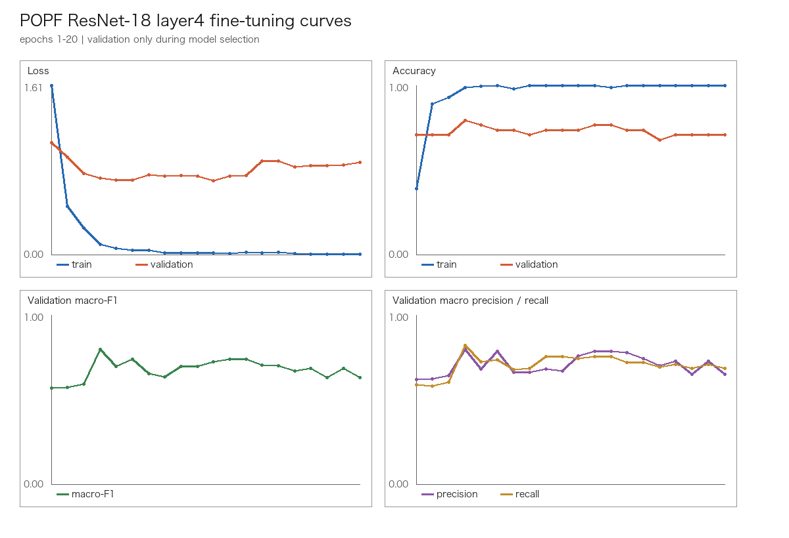
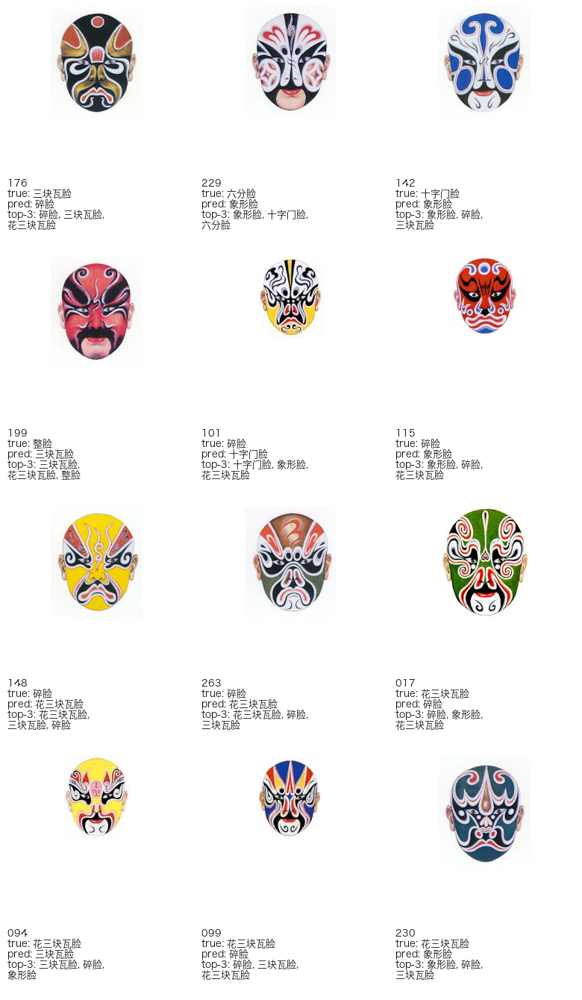

# POPF ResNet-18 Layer4 Controlled Fine-tuning Report

Status: `2026 Reconstruction` experiment. This is not a 2019 Original result.

Run timestamp (UTC): `2026-09-21T13:15:27.150167+00:00`

## 1. Experiment purpose

This experiment tests whether unfreezing only ResNet-18 `layer4` plus the new classification head improves generalization over the frozen-backbone baseline.
The experiment changes the trainable parameter set only. Dataset files, labels, split membership, preprocessing, class weights, seed, optimizer family, batch size, weight decay, epoch count, and test holdout remain controlled.

## 2. Data and controls

- Dataset: `POPF modern_v1`
- Images: `222` (`train=154`, `validation=34`, `test=34`)
- Classes: `7`
- Split files were not regenerated or modified.
- Test data was not read during training or validation model selection; it was evaluated once after selecting the best validation macro-F1 checkpoint.

| Condition | Frozen baseline | Layer4 fine-tuning |
|---|---|---|
| Model | ImageNet ResNet-18 | ImageNet ResNet-18 |
| Trainable modules | `fc` | `layer4`, `fc` |
| Input | RGB 224x224 | RGB 224x224 |
| Augmentation | none | none |
| Loss | train-only weighted CE | train-only weighted CE |
| Optimizer | AdamW | AdamW |
| Batch size | 16 | 16 |
| Weight decay | 1e-4 | 1e-4 |
| Epochs | 20 | 20 |
| Seed | 42 | 42 |

| Label | Total | Train | Class weight |
|---|---:|---:|---:|
| 三块瓦脸 | 73 | 51 | 0.431373 |
| 碎脸 | 45 | 31 | 0.709677 |
| 象形脸 | 35 | 25 | 0.880000 |
| 花三块瓦脸 | 27 | 19 | 1.157895 |
| 整脸 | 17 | 11 | 2.000000 |
| 十字门脸 | 15 | 11 | 2.000000 |
| 六分脸 | 10 | 6 | 3.666667 |

## 3. Model structure and trainability audit

- Frozen: `conv1`, `bn1`, `layer1`, `layer2`, `layer3`
- Trainable: `layer4`, `fc`
- Parameters: `8397319` trainable / `2782784` frozen / `11180103` total
- Layer4 learning rate: `0.0001`
- FC learning rate: `0.001`

| Module | Trainable | Parameters | Trainable parameters |
|---|---:|---:|---:|
| conv1 | False | 9408 | 0 |
| bn1 | False | 128 | 0 |
| layer1 | False | 147968 | 0 |
| layer2 | False | 525568 | 0 |
| layer3 | False | 2099712 | 0 |
| layer4 | True | 8393728 | 8393728 |
| fc | True | 3591 | 3591 |

## 4. Training curves and validation selection



- Best epoch by validation macro-F1: `4`
- Best validation accuracy: `0.794118`
- Best validation macro-F1: `0.797959`

| Label | Validation F1 at selected epoch |
|---|---:|
| 三块瓦脸 | 0.833333 |
| 碎脸 | 0.666667 |
| 象形脸 | 1.000000 |
| 花三块瓦脸 | 0.285714 |
| 整脸 | 1.000000 |
| 十字门脸 | 0.800000 |
| 六分脸 | 1.000000 |

## 5. Final test evaluation

The selected validation checkpoint was evaluated on the test split once.

- Accuracy: `0.617647`
- Macro precision: `0.608844`
- Macro recall: `0.543476`
- Macro F1: `0.554313`
- Top-3 accuracy: `0.882353`

### Confusion matrix

Rows are true labels and columns are predicted labels, in label-mapping order.

```text
[[10, 1, 0, 0, 0, 0, 0], [0, 3, 1, 2, 0, 1, 0], [0, 1, 4, 0, 0, 0, 0], [1, 2, 1, 0, 0, 0, 0], [1, 0, 0, 0, 2, 0, 0], [0, 0, 1, 0, 0, 1, 0], [0, 0, 1, 0, 0, 0, 1]]
```

### Per-class metrics

| Label | Support | Precision | Recall | F1 |
|---|---:|---:|---:|---:|
| 三块瓦脸 | 11 | 0.833333 | 0.909091 | 0.869565 |
| 碎脸 | 7 | 0.428571 | 0.428571 | 0.428571 |
| 象形脸 | 5 | 0.500000 | 0.800000 | 0.615385 |
| 花三块瓦脸 | 4 | 0.000000 | 0.000000 | 0.000000 |
| 整脸 | 3 | 1.000000 | 0.666667 | 0.800000 |
| 十字门脸 | 2 | 0.500000 | 0.500000 | 0.500000 |
| 六分脸 | 2 | 1.000000 | 0.500000 | 0.666667 |

## 6. Baseline versus fine-tuning

- Frozen baseline best validation epoch: `13`

| Metric | Frozen baseline | Layer4 fine-tuning | Difference |
|---|---:|---:|---:|
| Validation accuracy | 0.676471 | 0.794118 | +0.117647 |
| Validation macro-F1 | 0.671457 | 0.797959 | +0.126502 |
| Test accuracy | 0.441176 | 0.617647 | +0.176471 |
| Test macro precision | 0.578571 | 0.608844 | +0.030272 |
| Test macro recall | 0.466357 | 0.543476 | +0.077118 |
| Test macro-F1 | 0.481793 | 0.554313 | +0.072520 |
| Test top-3 accuracy | 0.852941 | 0.882353 | +0.029412 |

| Label | Baseline test F1 | Fine-tuning test F1 | Difference |
|---|---:|---:|---:|
| 三块瓦脸 | 0.705882 | 0.869565 | +0.163683 |
| 碎脸 | 0.266667 | 0.428571 | +0.161905 |
| 象形脸 | 0.400000 | 0.615385 | +0.215385 |
| 花三块瓦脸 | 0.000000 | 0.000000 | +0.000000 |
| 整脸 | 0.500000 | 0.800000 | +0.300000 |
| 十字门脸 | 0.500000 | 0.500000 | +0.000000 |
| 六分脸 | 1.000000 | 0.666667 | -0.333333 |

Baseline test confusion matrix:

```text
[[6, 1, 2, 1, 0, 1, 0], [0, 2, 3, 2, 0, 0, 0], [0, 2, 3, 0, 0, 0, 0], [0, 3, 1, 0, 0, 0, 0], [0, 0, 1, 1, 1, 0, 0], [0, 0, 0, 1, 0, 1, 0], [0, 0, 0, 0, 0, 0, 2]]
```

Fine-tuning test confusion matrix:

```text
[[10, 1, 0, 0, 0, 0, 0], [0, 3, 1, 2, 0, 1, 0], [0, 1, 4, 0, 0, 0, 0], [1, 2, 1, 0, 0, 0, 0], [1, 0, 0, 0, 2, 0, 0], [0, 0, 1, 0, 0, 1, 0], [0, 0, 1, 0, 0, 0, 1]]
```

## 7. Error analysis and overfitting

- Test top-1 error tiles rendered (capped at 12): `12`.
- Full fine-tuning top-k predictions: `../artifacts/experiments/resnet18_layer4_finetune/test_predictions_top3.csv`
- Baseline versus fine-tuning prediction comparison: `../artifacts/experiments/resnet18_layer4_finetune/baseline_vs_finetune_test_predictions.csv`



- At the selected epoch, train accuracy was `0.987013` and validation macro-F1 was `0.797959`; the raw gap is `+0.189054`.
- A large train/validation gap is treated as an overfitting warning, not as evidence of better generalization.

## 8. Next step

Fine-tuning shows a measurable test macro-F1 improvement; the next single experiment should test a more conservative fine-tuning schedule while keeping the same split and test holdout.
No next experiment was executed automatically.

The approximately 70% accuracy reported by the 2019 paper is historical `2019 Original` context and is not compared to this `2026 Reconstruction` result.

## 9. Reproducibility

- Python: `3.14.7`
- PyTorch: `2.14.0`
- torchvision: `0.29.0`
- Device: `cpu`
- Raw input SHA-256 recorded before and after: `{'data/raw/脸谱/整理工作/爬虫脸谱图集.zip': '171006b1eaae62b095b54b8472ded55ac2ac8b6803750c1c232e47a617a96b5a', 'data/raw/脸谱新一步/272数据张丹阳.xls': 'fa37243d2665a613bd52cf617f11d35db7f1a24c10c72bac89926c457ce109cc'}`
- Dataset split SHA-256: `{"train": "124779d85ee5c160264832e480dbd35c2a5541bc5cf42e50362c5bcd82656253", "validation": "1341665096ceb34056053a50750872472dee872cc39344e023324276441897c3", "test": "1dab96bb90c848871a0cb93f1559c9e7b1f5620f379400a53bfdf98e56031f58"}`

No raw file or modern dataset split was modified by this experiment.
